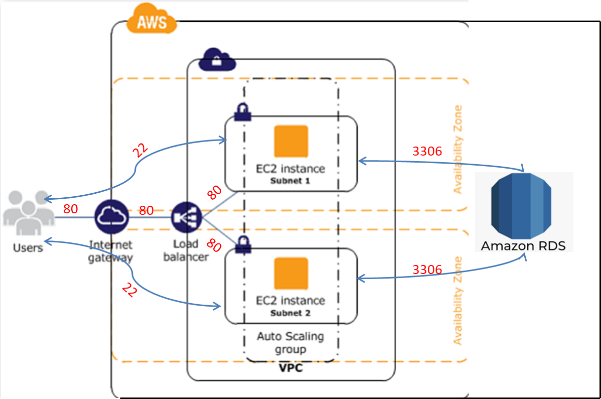

# Phonebook Application (Python Flask) deployed on AWS ApplicationLoadBalancer with Auto Scaling and Relational Database Service using Terraform

## Description

The Phonebook Application aims to create a phonebook application in Python and deployed as a web application with Flask on AWS Application Load Balancer with Auto Scaling Group of Elastic Compute Cloud (EC2) Instances and Relational Database Service (RDS) using Terraform.




## Requirements

  - The application should be created with new AWS resources.

  - Template should create Application Load Balancer with Auto Scaling Group of Amazon Linux 2 EC2 Instances within default VPC.

  - Application Load Balancer should be placed within a security group which allows HTTP (80) connections from anywhere.

  - EC2 instances should be placed within a different security group which allows HTTP (80) connections only from the security group of Application Load Balancer.

  - The Auto Scaling Group should use a Launch Template in order to launch instances needed and should be configured to;

    - use all Availability Zones.

    - set desired capacity of instances to `2`

    - set minimum size of instances to `1`

    - set maximum size of instances to `3`

    - set health check grace period to `300 seconds`

    - set health check type to `ELB`

  - The Launch Template should be configured to;

    - prepare Python Flask environment on EC2 instance,

    - download the Phonebook Application code from Github repository,

    - deploy the application on Flask Server.

  - EC2 Instances type can be configured as `t2.micro`.

  - Instance launched by Terraform should be tagged `Web Server of Phonebook App`

  - For RDS Database Instance;
  
    - Instance type can be configured as `db.t2.micro`

    - Database engine can be `MySQL` with version of `8.0.19`.

  - Phonebook Application Website URL should be given as output by Terraform, after the resources created.

## Project Skeleton 

```text
002-tf-phonebook-web-application (folder)
|
|----readme.md               # Given to the students (Definition of the project)
|----main.tf                 # To be delivered by students (Terraform Configuration) 
|----phonebook-app.py        # Given to the students (Python Flask Web Application)
|----templates
        |----index.html      # Given to the students (HTML template)
        |----add-update.html # Given to the students (HTML template)
        |----delete.html     # Given to the students (HTML template)
```
